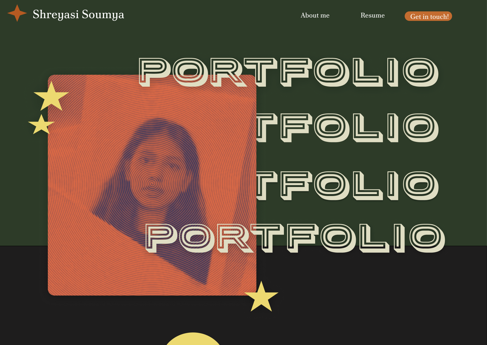
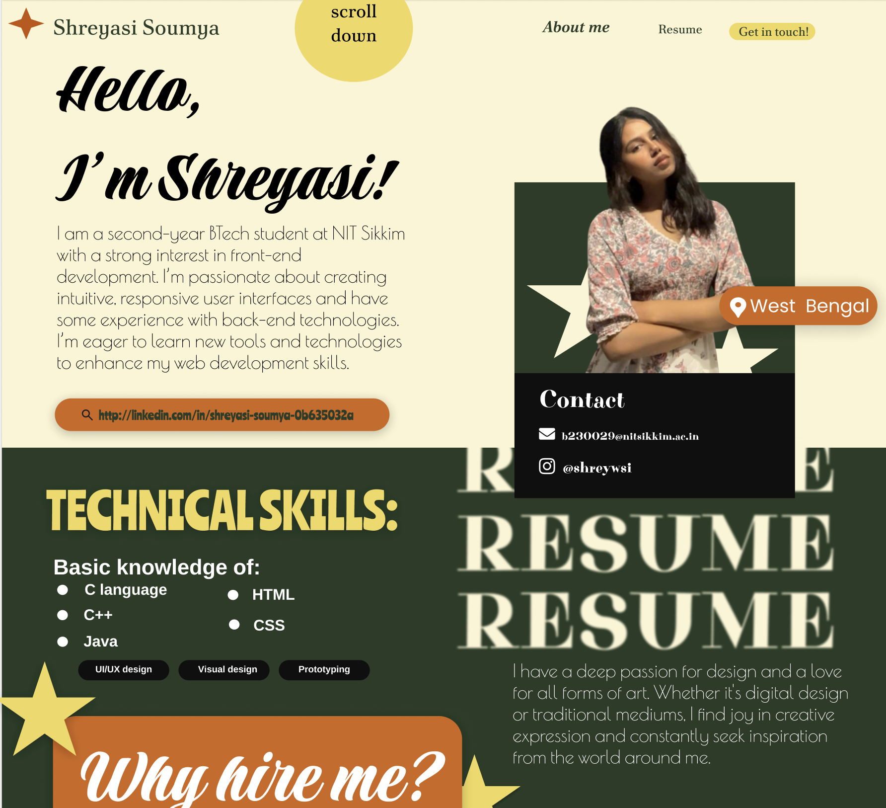
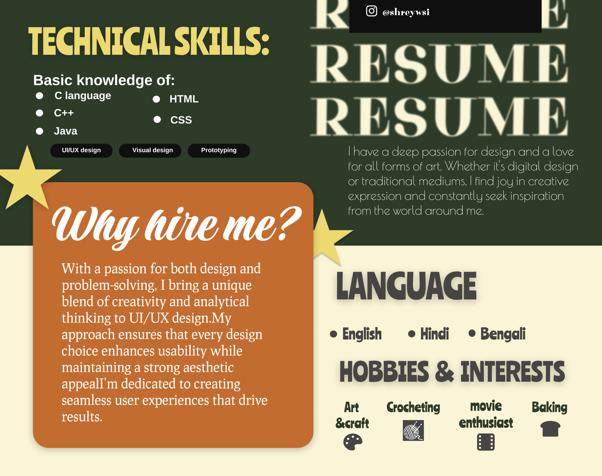

#  Shreyasi's Portfolio Design (Figma)

This repository showcases a **personal portfolio UI** I designed in **Figma**. The static page demonstrates my design thinking, layout structuring, and visual styling as a frontend enthusiast.

->  Designed with a focus on creativity, clarity, and personality.

---

##  Preview

###  Full Page

---

###  Hero Section

---

###  Technical Skills + Resume

---

###  Why Hire Me?

---

##  Tools Used

- [Figma](https://figma.com) for design
- GitHub for showcasing
- Screenshot tools for closeups

---

##  What's Next?

I plan to:
- Convert this design to **HTML/CSS** or **Framer/Webflow**
- Build a **live interactive site**
- Use it as a base for my personal website!

---

##  Connect With Me

📍 West Bengal  
📧 b230029@nitsikkim.ac.in 
🔗 [LinkedIn](https://www.linkedin.com/in/shreyasi-soumya/)

